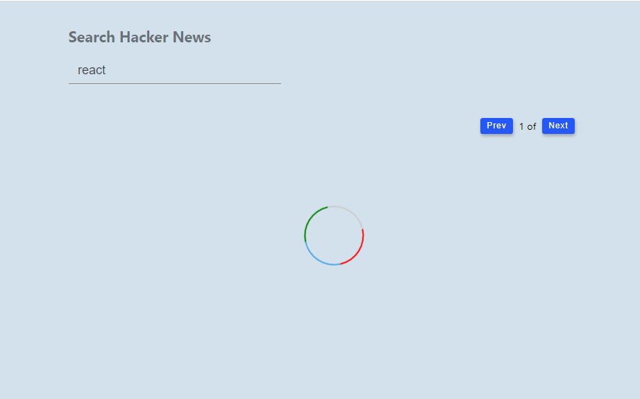
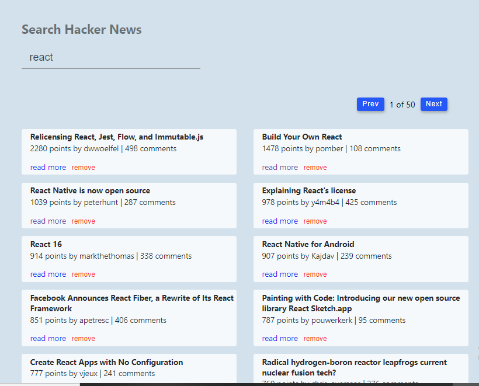
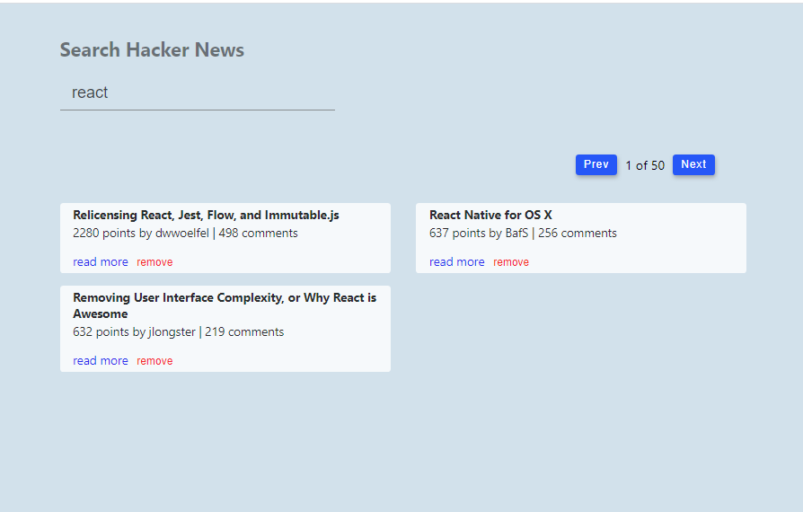
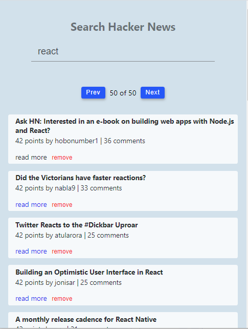

# Hacker-News

Completed the Hacker News mini react project using the API from Algolia (https://hn.algolia.com/api/v1/search?)
the data obtain from the API call is rendered to the browser as showm below

# Desktop View

# The Loading Phase

# Data is rendered to the browser

# Some Data can be remove using the remove button

# Mobile view

